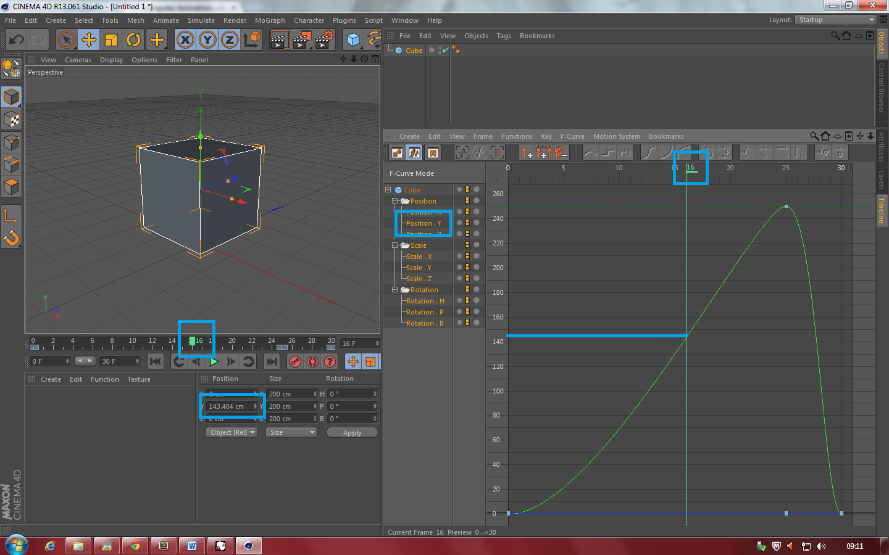

# Unit 31 &ndash; Computer Animation
### Assignment 1: P1, P2, M1
## Types and Techniques of Animation [P1]

	
	Example of an animation with onion skinning in use. The older the frame, the more transparent it appears. Although popularised by the introduction of computers in animation, onion skinning can be used in hand-drawn cartoons too, by use of translucent paper.
	
"Onion skin". Licensed under Creative Commons Attribution-Share Alike 2.5 via Wikimedia Commons - <a href="https://commons.wikimedia.org/wiki/File:Onion_skin.png#mediaviewer/File:Onion_skin.png">link</a>

* **Movement** &mdash; An animation is always made up of a number of frames showed for short amounts of time and in quick succession. There are two primary ways to generate these frames and achieve the illusion of movement, and their effectiveness was once believed to rely on [persistence of vision](#persistence).

	* **Frame-by-frame** &mdash; The more tedious and less efficient method of animation involves drawing every frame individually. A technique called onion skinning may well be used to make sure the frames play smoothly as an animation, by allowing the animator to the see the previous frames as each is drawn.

	* **Tweening** &mdash; To achieve a more fluid final animation, illustrators can create a number of keyframes and then draw 'tweens (short for *betweens*). Keyframes are typically found at significant or regular points in the animation, e.g., at 5&ndash;10 frame intervals, and are the most important frames; even an inexperienced animator can fill in the 'tweens. This was key is producing long animations in the past, as the lead animator could draw the significant parts of the keyframes, and then employ others to draw the 'tween frames, scenery, colour, shading, etc.  
	In modern computer generated animation, the creator simply defines a number of frames, and the computer calculated the frames between. This process of calculation is called interpolation.

	
	Footage of a racing event, clipped to the shape of text, using masking.
	

		Image from <a href="http://www.sonycreativesoftware.com">sonycreativesoftware.com</a>
	

* **Masking** &mdash; The adoption of one video layer's alpha channel by another layer is the core principal behind masking. The main use of masking is to "clip" a given piece of footage to a particular shape, so that part of it, such as a person, can be laid over different footage.  
One of the most common techniques in modern filmography is green-screening. Scenes are shot against a green background, which can then be "keyed out" in digital post production. The process of removing the green background and replacing it with any computer generated or filmed scene the animator desires is effectively masking.

* **Morphing** &mdash; More likely perhaps in cartoons, an animator may want to gradually change one object or character into another. The process of changing the shape over time is called morphing, and can be achieved by means of frame-by-frame animation or tweening. Morphing could be used to change one character's face or body into another's. With the advent of CGI, morphing became a lot easier. Computer algorithms allow animators to quickly generate motion paths for individual polygons, creating smooth morphs, before tweaking the animation if needs be.

	
	Keyframes and 'tween frames in the CG animation application Cinema 4D. In this example, a cube's position on the y-axis is set to 0cm at frames 0 and 30, and to 250cm at frame 25. The three keyframes are all that are needed in order to animate the cube rising, then rapidly falling again, and the interpolation that Cinema 4D calculates for this movement is shown on the right. Looking at the graph, and given the frame number, one can see that it correlates with the value in the y-axis box below the 3D view. 
	The software also allows the animator to change this B&eacute;zier curve easily, without the need for more keyframes.
	
Screenshot taken by me

# Uses of Animation

Computer animation has many different applications, and can be easily adapted to suit its need. Some of the most common uses of animation are listed and summarised below.

* **Advertising** &mdash; Many of the adverts seen on television and in other media are computer generated. The freedom of computer animation allows businesses and marketing teams to create captivating worlds, scenes and characters. The cost of designing and rendering CG imagery was once extremely high, but has dropped rapidly to such an extent that animation is often a much cheaper route for studios to take. In the small window of 30 seconds, a story has to be told and an idea sold, and computer animation lets this happen.

* **Creative Arts** &mdash; Animation is also used extensively by artists. The medium of film and motion has always been popular, but now that anyone is able to create at least basic content. Using software like Cinema 4D, Maya and 3DS Max, it's possible to create complex animations relatively easily by use of keyframing, textures and advanced physics simulation.

* **Entertainment** &mdash; Film was revolutionised when the first feature-length computer-generated movies were released in cinemas. Notable examples of these films include Toy Story and Shrek, created by Pixar Animation and DreamWorks respectively. At a time when entire computational farms would render for months on end to create such a long piece, the concept of animation in cinema was unbelievable to many. Render farms operating on several thousand servers are now capable of rendering these projects in days or even hours.

* **Education** &mdash; Animation and computer graphics in general are used extensively in science. Complex particle-based systems and physics simulators often now take longer to compute and "bake" than to render to an image or film. Animation is also often used for public announcements on television or the internet. Public safety advertisements in print also often make use of computer generated imagery.

* **Simulation** &mdash; Universities and scientific institutions are increasingly making use of computer programs in order to simulate different events for a number of reasons. For example, researchers have built huge sections of the universe digitally using particle simulation, allowing them to accurately predict the movement of planets, stars and entire galaxies over millions of years.

# Persistence of Vision

It was historically believed that when the human eye sees an image which is then processed by the brain, a remnant of it remains in the mind for a period of time after the subject has changed &ndash; estimated to be around one twenty-fifth of a second. It was thought that the persistence of vision effect led to the illusion of smooth motion we see when viewing animation and video; the perception of motion. Persistence of vision was considered something that happened in the eye, and perception of motion something that occurred as a result in the mind. The fact that animations are simply a series of frames played in quick succession, but that appear to show moving objects, was often used as an example of persistence of vision.

	
	In the animated image above, the gap appears to be filled with a green blurred dot, like the pink dots, when a person stares at the centre cross for few seconds. This is an example of the phi phenomenon.
	
"Lilac-Chaser" (Original uploader TotoBaggins, later uploads by Howcheng). Licensed under Creative Commons Attribution-Share Alike 3.0 via Wikimedia Commons - <a href="https://commons.wikimedia.org/wiki/File:Lilac-Chaser.gif#mediaviewer/File:Lilac-Chaser.gif">link</a>

When viewing moving objects in real life, motion blur is added to the images our eyes detect, making it easier for our minds to interpret what we're seeing. Without motion blur, moving objects in our vision would seemingly disappear and reappear as they moved, instead of gradually moving, and we would be less able to estimate the speed of moving objects. Some televisions are able to display video at a framerate of more than 120Hz, and motion designers usually add motion blur digitally before rendering clips in order to achieve the best results. In fact, if the content has not been processed by motion blurring algorithms, the video can give viewers headaches.

The discovery of the phenomenon of persistence of vision has been attributed to a number of people; most notably Lucretius, a Roman poet, and Peter Mark Roget. It has been scientifically decided that an animation shown at fewer than 16 frames per second is obviously an animation, and that most can clearly see the frame changes as they occur. This threshold is higher in cinema and on older televisions, as the screen is unable to remain lit between frame changes. Persistence of vision was believed to have helped make this momentary black image less noticeable when a video was played.

The theory of persistence of vision has been disproven since 1912, and the persistence of motion explained instead by the phi phenomenon and beta movement, which are often confused.

* The phi phenomenon refers to the perception of an object or shape where there isn't one, often as a result of a pattern of items being broken by a gap. This is shown in the GIF above.

* Beta movement is key in perception of motion, and involves the human brain interpreting an image shown by stationary objects as moving. An example of this can be shown by any computer screen or LED matrix. Although the images we see on these displays are simply drawn by a number of small lights switching on and off at particular times, we believe we see a moving object. This can be seen in a lot of train stations as arrays of LEDs are often used to display information to passengers; the text shown appears to scroll from one side of the display to the other.

## Devices

	
	A photo of a phenakistoscope with thirteen frames of an animation depicting a couple dancing.
	
"Phenakistoscope 3g07690u". Licensed under Public domain via Wikimedia Commons - <a href="http://commons.wikimedia.org/wiki/File:Phenakistoscope_3g07690u.jpg#mediaviewer/File:Phenakistoscope_3g07690u.jpg">link</a>

A number of devices have been created throughout history that claim to showcase the theory of persistence of vision. Some of the most popular are listed below.

* **Phenakistoscope** &mdash; Built in the form of a disc, a phenakistoscope consists of a number of frames all orientated towards the centre of a circle. The disc is spun, and then viewed in a mirror through the slits cut at even intervals around the circle. These narrow slits use the same principal as those in a zoetrope, stopping the user from seeing motion blur in the images as the disc spins.

* **Zoeotrope** &mdash; Arguably one of the most well known forms of early animation, a zoetrope consists of a open-ended cylinder of some material. In the top half of the cylinder, there are thin, vertical slits cut, and on the inside of the cylinder in the bottom half frames of an animation are drawn or printed. For the effect to work, the number of frames and slits must be the same, and they are both typically placed at regular intervals all the way around the cylinder. The cylinder is usually mounted on a rotating spindle and rotated quickly. The user looks through the area where the cuts have been made, and towards the images on the inside. Because the slits and the images move in opposite directions in terms of the viewer's vision, the blurring effect prevented and an animated clip is revealed. The invention of the zoetrope in the 1830s is largely accredited to William Horner, who named it the daedaleum.

* **Flip book** &mdash; Consisting of a number of bound pages each with a frame of an animation on, a flip book relies on the pages being turned smoothly and quickly. The viewer sees each page for a split second and the images on them become an animation. Motion blur as each pages moves means that the animation doesn'r always look as good as with other devices, and is rarely as smooth. Despite this, longer animations are easier to create with a flip book than with a zoetrope, for example.

* **Magic lantern** &mdash; One of the earliest forms of projects, magic lanterns used concave (dented inwards) mirrors to reflect as much light as possible though a small translucent slide. This slide could be painted on or made in a photographic process. The lantern would typically be pointed at a white wall in order to display the image. A lens in the lantern could be adjusted in order to change the focus of the projected image.

## Techniques and Use in Animation

	
	An example of rotoscoping, using a picture of a woman in a car.
	
Image from <a href="http://ceasefiremagazine.co.uk/">ceasefiremagazine.co.uk</a>

* **Cel animation** &mdash; Referring to the use of celluloid sheets, cel animation involves an artist drawing characters on paper before inking them onto a transparent cellulose nitrate or cellulose acetate film. Colour ink or paint, likely acrylic, is then painted on the other side of the sheet to add colour to the cartoons, without covering up the inked outlines. The film is them flipped once more, and scanned in order to be used. In modern animation, computers have negated the need for this process, and almost all animation studios have stopped using the traditional cel method.

* **Rotoscope** &mdash; In many cartoons where high quality and realistic characters are desired, rotoscoping is used. This involves using live-action footage as the basis of an animation, and then tracing inked lines over the top. Cel-shading is typically used afterwards to colour the image.